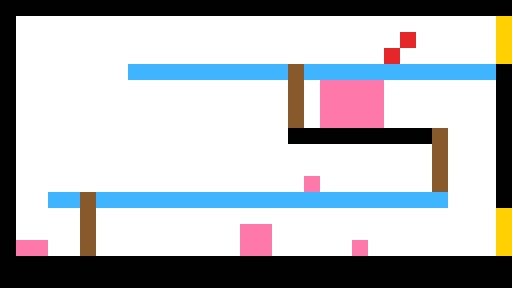
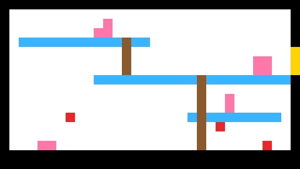
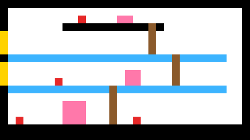

# Procedural Game-Room Schema Generator

A small tool that generates **pixel-perfect level schemas** for a 2D platformer
level constructor. Press "Generate" and get a fresh, valid, playable room — as a
repeatable process, not a lucky one-off.


Each pixel = 1×1 m of game space; each color = an object type the game's level
constructor places (walls, pass-through platforms, ladders, doors, destructible
decor, enemies).





## The core idea: AI decides, deterministic code guarantees

The obvious approach — a generative image model (Stable Diffusion / GPT-image) —
**does not work here**: it produces anti-aliasing, new shades and semi-transparent
pixels, which breaks the hard requirement of a fixed palette and pixel-exact output.

So the architecture splits responsibility:

- **AI (Claude via CLI)** handles the *creative* part — the floor layout (heights,
  widths, materials). Optional; see `ai_layout.py`.
- **Deterministic code** handles everything that must be *guaranteed*: ladders
  connect floors by construction, doors/decor/enemies are placed without overlaps,
  and every room is validated before it is saved.

If the AI returns an invalid plan, the system **falls back** to pure procedural
generation on the same core — so a model hiccup degrades gracefully instead of
producing a broken room.

## Validation before save (this is the point)

Every generated room is checked automatically:

1. **Palette** — the image contains *only* colors from the legend, nothing else.
2. **Connectivity / passability** — a BFS traversal confirms every zone of the room
   is reachable (via floors and ladders). Rooms that fail are regenerated (up to 10
   attempts).

Rendering is a direct pixel fill (PIL, no interpolation), so sub-pixel artifacts
cannot occur by construction.

## Stress test

20 consecutive generations (different seeds) — **20/20 passed both checks on the
first attempt**, in both AI-assisted and pure-procedural modes.

## Run

```bash
# pure procedural (no AI, zero cost)
python3 room_generator.py --count 3 --seed 7

# AI-assisted floor layout (uses the `claude` CLI)
python3 room_generator.py --count 3 --seed 7 --ai --model haiku --effort low

# minimal GUI
python3 ui.py
```

Configurable: `--width --height --doors --enemies --decor --seed --ai --model --effort`.

Requirements: Python 3, [Pillow](https://python-pillow.org/). AI mode additionally
needs the `claude` CLI on `PATH`.

## Legend

| Color | Meaning | Size |
|-------|---------|------|
| Black | Walls / floor / ceiling | any shape |
| Light blue | Thin platform (pass-through) | 1 m tall, any width |
| Brown | Ladder | 1 m wide, any height |
| Yellow | Door | 3×1 m |
| Pink | Destructible decor | 1×1, 1×2, 2×1, 2×2, 3×3, 4×3 |
| Red | Enemy (ground or flying) | 1×1 |

## Design notes

- Connectivity is guaranteed *by construction* (ladders always link adjacent
  floors), not left to chance — this is why the pass rate is 100%.
- Passability is modeled conservatively through ladders only (no jump-height
  physics) — stricter than a real platformer needs, but guaranteed-reachable
  without a physics engine.
- Single layout pattern (floors + ladders) for now; additional patterns
  (vertical / maze) would slot in as extra modes.

## Files

- `room_generator.py` — generator, validators (palette + BFS connectivity), renderer, CLI
- `ai_layout.py` — optional bridge to the `claude` CLI for AI floor layout
- `ui.py` — minimal Tkinter GUI (Generate button, live preview, "Reveal file")
